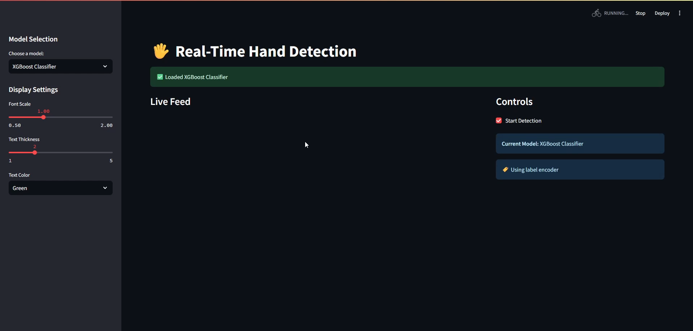

# ML-1-project

## Overview

Going back to traditional machine learning projects was far from my mind, but the more you learn, the more you realize how much you don't know.

This project is part of my ITI AI track diploma. I built a simple machine learning model to detect hand gestures in real-time—a basic project you can find anywhere.

However, this time I learned things I had never done before, such as saving preprocessing steps, organizing ML training notebooks, and easily reusing models with their corresponding trained preprocessing.

---

## Branch: `mlflow`

This branch is a task in the **ITI AI Track** diploma.

The goal is to integrate **MLflow** into the training pipeline to track experiments, log hyperparameters, metrics, and models — making it easy to compare runs and reproduce results.

### What's tracked with MLflow

| Category | Details |
|---|---|
| **Dataset** | Raw data logged as an MLflow dataset input |
| **Parameters** | Best hyperparameters from `RandomizedSearchCV`, dataset shape |
| **Metrics** | Accuracy, F1, Recall, Precision, Best CV Score |
| **Models** | Each trained model logged with its input/output signature |
| **Artifacts** | Preprocessing pipelines, visualizations (PCA plots, keypoint plots, label distribution) |

### Run structure

```
full_pipeline  (parent run)
├── Support Vector Classifier   (nested run)
├── Logistic Regression         (nested run)
├── Random Forest Classifier    (nested run)
└── XGBoost Classifier          (nested run)
```

---

## Code Structure

```
ML-1-project/
├── data/
│   └── hand_landmarks_data.csv    # Training dataset
├── media/                         # Demo videos and images
├── models/                        # Trained machine learning models (.joblib)
├── processors/                    # Saved preprocessing (LabelEncoder, etc.)
├── artifacts/                     # Auto-generated plots logged to MLflow
├── mlflow.db                      # MLflow SQLite tracking store (auto-generated)
├── ml_project.py                  # Main training pipeline (functions-based)
├── streamlit_demo.py              # Real-time UI detector
├── terminal_demo.py               # CLI version of the detector
├── transformers.py                # Custom data transformation logic
├── requirements.txt               # Project dependencies
└── README.md                      # This file
```

---

## How to Run

### 1. Install dependencies

```bash
pip install -r requirements.txt
```

> Or with `uv`:
> ```bash
> uv pip install -r requirements.txt
> ```

### 2. Run the training pipeline

```bash
python ml_project.py
```

This will:
- Load and visualize the dataset
- Preprocess the hand landmark features
- Train 4 models (SVC, Logistic Regression, Random Forest, XGBoost) with hyperparameter search
- Log everything to MLflow under the `hand-gesture-classification` experiment

---

## Inspecting MLflow Results

### Launch the MLflow UI

```bash
mlflow ui --backend-store-uri sqlite:///mlflow.db
```

Then open your browser at **http://127.0.0.1:5000**

### What you can do in the UI

- Browse the `hand-gesture-classification` experiment
- Compare metrics (accuracy, F1, recall, precision) across all 4 models
- Inspect logged hyperparameters per run
- Download saved models and preprocessing artifacts
- View the nested run structure (parent `full_pipeline` → child model runs)


> **Note**: I didn't push the model weights to Github to keep the repo size small, but you can find them in the `models/` directory after running the training pipeline.
---

## Demo Video

[](media/demo.mp4)

